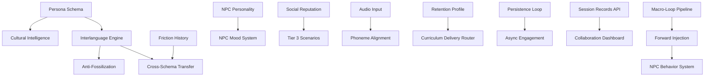

# AAPM Router — Framework Routing Mechanism

> Maps build task types to the correct files, prompts, and components in the right
> logical order. Includes workarounds for every anticipated failure mode.
>
> Read this after `.cursorrules` and before any code generation.

---

## Build Task → Framework Routing Table

| Build Task | Primary Frameworks to Load | Workaround if Blocked |
| --- | --- | --- |
| **New domain lifesim** | `persona.schema.json` → `recipes/new-persona-from-scratch.md` → `recipes/new-tier2-environment.md` → all system prompts | Use `premier-league.yaml` as 1:1 template; replace domain fields only |
| **Add new NPC** | ADR-010 → `persona-schema-guide.md` → `tier2-immersion-npc.md` → `forward-injection-briefing.md` | Clone nearest existing NPC schema block; change Big Five personality only |
| **Implement Macro-Loop** | `feedback-engine.md` → `pipeline.ts` → `micro-curriculum-generator.md` → `friction-analysis.md` | Use friction-analysis prompt standalone; wire output manually into curriculum generator |
| **Add new language pair** | `language-expansion-checklist.md` → ADR-011 → interlanguage-engine types | Start with English pair; map new L1 by substituting phoneme table only |
| **Build Tier 3 scenario** | `three-tiers.md` → `tier3-authority.md` → `negotiation-collapse-recovery.md` → ADR-005 | Use `university-admissions.yaml`; its contract scenario is the simplest Tier 3 pattern |
| **Wire Phoneme Engine** | ADR docs → phoneme-engine types → Azure Speech SDK / Wav2Vec docs | Use text-only friction detection; flag audio as TODO; ship without breaking Tier 1-2 |
| **Add reputation persistence** | ADR-005 → persistence types → `session-lifecycle.md` | Use in-memory reputation map first; swap for vector DB in Phase 9 |
| **Implement Anti-Fossilization** | ADR-007 → anti-fossilization types → IHE (ADR-006) must be active first | Implement IHE first; AFE depends on IHE confidence scores |
| **Multimodal input** | `multimodal-prompt-guide.md` → schema multimodal fields → refraction types | Default to text; add audio flag in schema; route to Phoneme Engine if flag set |
| **Runtime customization UI** | `aam-charter.md` → `ui/components` → `interaction-loop.md` | Expose controls as debug panel first; promote to production UI in final phase |
| **Cross-schema transfer** | `model-substitution.md` → persistence types → `cross_schema_transfers` field | On schema swap, copy friction\_history only; ignore vocab transfer until IHE stable |

---

## Dependency Graph — Build Order Enforcement

Hard constraints. Violating these produces code that compiles but fails at runtime.

| Module | Must Be Operational First |
| --- | --- |
| Anti-Fossilization Engine (AFE) | Interlanguage Hypothesis Engine (IHE) — AFE reads IHE confidence scores |
| Forward Injection | Macro-Loop Pipeline (phases 1-3 generate the directives) |
| Tier 3 Scenarios | Social Reputation System (Tier 3 NPC behavior is reputation-gated) |
| Phoneme Alignment Engine | Audio input pipeline (ASR preprocessing wired before PAE receives input) |
| Cultural Intelligence Model | Persona Schema (CQ norms are schema-derived) |
| Micro-Curriculum Delivery Router | Retention Profile (format is retention-profile-selected) |
| NPC Mood System | NPC Personality Model (mood is a delta on personality baseline) |
| Async Engagement Triggers | Persistence Loop (triggers scheduled post-session; requires session records) |
| Collaboration Dashboard | Session Records API (dashboard reads session records) |
| Cross-Schema Transfer | IHE + Friction History (both must have data before transfer logic runs) |

→ See `docs/dependency-graph.md` for the full visual specification.

---

## Workaround Library — Every Anticipated Failure Mode

| Failure Mode | Symptom | Workaround |
| --- | --- | --- |
| **LLM API rate limit** | NPC responses timeout or return empty | Implement exponential backoff + response cache keyed on `(npc_id, learner_input_hash)`. Return cached response if available. |
| **Schema validation failure** | CLI validator rejects YAML | Run `npx aapm validate schemas/examples/your-schema.yaml`. Fix field by field. Use `premier-league.yaml` as passing reference. |
| **IHE scores diverge on first session** | All rules flagged as fossilized immediately | Seed IHE with `confidence: 0.0` for all rules. Require minimum 3 sessions before AFE reads scores. |
| **No audio hardware** | PAE crashes on input | Wrap PAE in try/catch; fall back to text-only friction detection. Set `phoneme_engine_enabled: false` in session config. |
| **Forward Injection sounds scripted** | NPC dialogue feels unnatural; learner notices | Limit injection to 1-2 targets per session. Use `tier2-immersion-npc.md` Section 4 (Naturalness Constraints). |
| **Affective inference over-triggers** | System constantly reduces pressure; learner stagnates | Add minimum pressure floor per tier. Tier 1: 0.2, Tier 2: 0.4, Tier 3: 0.6. Hard-coded. |
| **NPC memory lost on schema swap** | NPC behaves as stranger after persona change | Preserve `npc_relationship` records on schema swap. Only `vocabulary_matrix` and `environment` fields reset. |
| **Identical BASIC and NATIVE refraction** | No useful gradient for learner | Enforce distinctness check: if `cosine_similarity(BASIC, NATIVE) > 0.85`, regenerate NATIVE. |
| **Tier 3 collapse too early** | Learner frustrated; session ends prematurely | Apply `negotiation-collapse-recovery.md` Soft Exit. Activate Companion as post-collapse debrief agent. |
| **Curriculum format ignored by learner** | Engagement drops | Default to Conversational Debrief (Companion-led) as universal fallback — requires no special rendering. |
| **Community schema breaks validation** | Schema marketplace schema conflicts with core types | Run CLI validator before merge. Add migration step in `schema-loader/migrations.ts`. |
| **Reputation score underflows** | NPCs refuse to interact; world feels hostile | Clamp reputation to `[0.0, 1.0]`. On underflow, trigger `soft-landing-protocol.md` Recalibration Sequence A. |
| **Vibecoding tool ignores .cursorrules** | Generated code violates AAPM philosophy | Prepend `.cursorrules` content directly into the first user message. Use master prompt from `VIBECODE_ENTRY.md`. |
| **Monorepo build fails after new package** | TypeScript path aliases unresolved | Copy `tsconfig.json` from `packages/core` as template. Add new package to root `tsconfig.json` references array. |
| **ZPD pushes too hard** | Response latency increases; L1 fallback spikes | Affective State Inference will detect this. If not wired, manually reduce tier difficulty by one level in session config. |

---

## Related Documents

| Document | Purpose |
| --- | --- |
| [VIBECODE_ENTRY.md](VIBECODE_ENTRY.md) | Master vibecoding prompt + build phases |
| [docs/dependency-graph.md](docs/dependency-graph.md) | Full dependency graph + quality gates |
| [docs/aam-charter.md](docs/aam-charter.md) | AAM philosophy + event bus + runtime controls |
| [.cursorrules](.cursorrules) | AAPM philosophy — always read first |

---

*"Dynamically Efficient and Efficiently Dynamic"*
