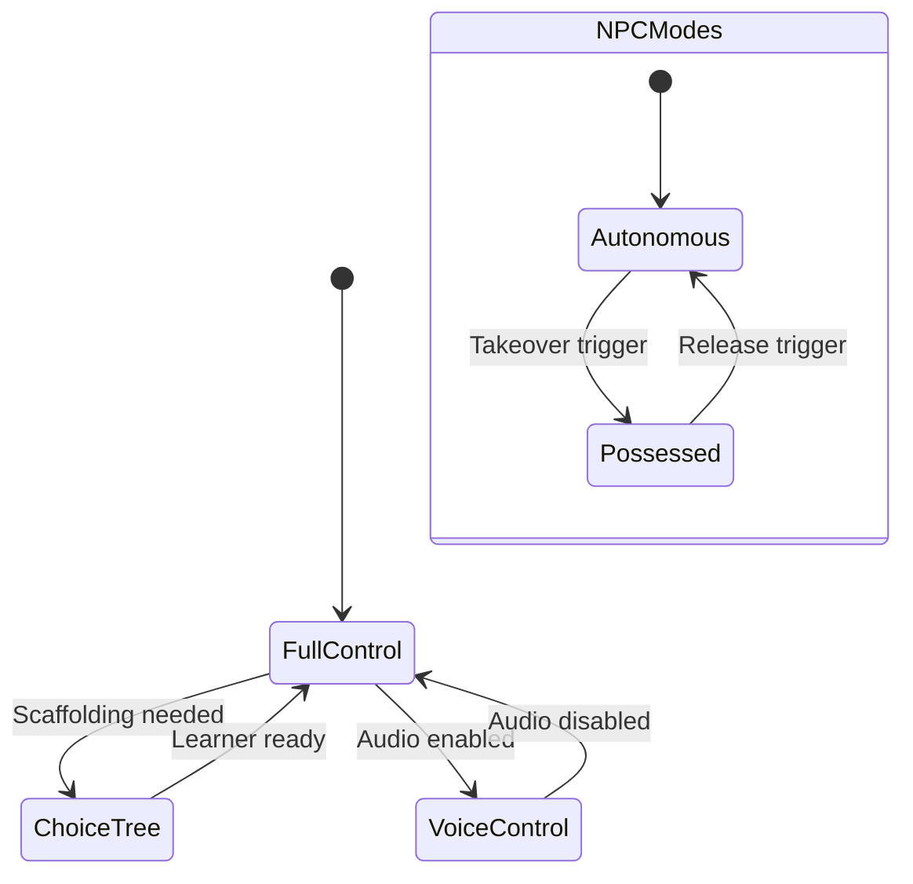

# Character Control Specification

> Taxonomy of controllable, semi-controllable, and autonomous characters
> in the AAPM simulation framework.

---

## Overview

The AAPM simulates a social world with multiple character types. The Autonomous and Adaptive Matrix (AAM) philosophy requires explicit control surfaces for each type so that vibecoded solutions generate the correct interaction patterns.

---

## Character Taxonomy

| Type | Control Model | Use Context | Example |
| --- | --- | --- | --- |
| **Player Character** | Full player control | Learner's avatar in the world | The learner themselves |
| **Companion** | Semi-autonomous dialogue partner | Tier 1 bilingual practice | AI Companion friend |
| **Choice-Tree NPC** | Player selects from branching options | Structured Tier 2 scenarios | Restaurant ordering, pharmacy visit |
| **Voice-Controlled NPC** | Player speaks; NPC responds | Audio-enabled sessions | Voice-based Companion or NPC |
| **Autonomous NPC** | Fully AI-driven | Tier 2 + 3 social world | Shopkeeper, landlord, colleague |
| **Hybrid NPC** | Normally autonomous; player can possess | Advanced scaffolding intervention | Learner takes over NPC to practice perspective |

---

## Control Modes

### Full Control (Player Character)

```typescript
interface PlayerCharacter {
  controlMode: 'full';
  inputModes: ('text' | 'voice' | 'choice')[];
  activeInputMode: 'text' | 'voice' | 'choice';
  canSwitchInputMode: boolean;          // runtime customization
  zpdPressureLevel: number;             // [0.0, 1.0]
  affectiveFilterState: 'low' | 'moderate' | 'elevated' | 'critical';
}
```

The learner always controls their own character. Input mode can be switched at runtime per the AAM charter.

### Choice-Tree Control

```typescript
interface ChoiceTreeNPC {
  controlMode: 'choice-tree';
  choicesPerTurn: 2 | 3 | 4;
  choiceGradient: boolean;              // choices ordered by register/difficulty
  includeL1Hint: boolean;              // show L1 translation alongside choices
  allowFreeText: boolean;              // learner can type instead of selecting
  zpdCalibration: 'choices-adapt-to-level' | 'fixed-choices';
}
```

Used when the learner needs more scaffolding. The system presents 2-4 response options, optionally ordered by difficulty. The learner may override with free text if `allowFreeText` is enabled.

### Autonomous NPC

```typescript
interface AutonomousNPC {
  controlMode: 'fully-autonomous';
  personality: BigFiveProfile;           // from ADR-010
  moodState: NPCMoodState;
  reputationWithLearner: number;
  forwardInjectionDirectives: string[];
  culturalOverlay: CulturalNorms;
  registerDefault: 'casual' | 'formal' | 'professional';
  patienceLevel: number;                 // [0.0, 1.0] — affects wait time
  responsiveness: 'eager' | 'neutral' | 'reluctant';
}
```

Fully AI-driven. Behavior determined by personality × mood × reputation. Forward Injection directives modify behavior invisibly.

### Hybrid NPC (Possessable)

```typescript
interface HybridNPC extends AutonomousNPC {
  controlMode: 'hybrid';
  playerCanPossess: boolean;
  takeoverTrigger: 'manual' | 'affective-threshold' | 'educator-assigned';
  takeoverDuration: 'single-turn' | 'scene' | 'until-released';
  pedagogicalPurpose: string;           // why possession helps learning
}
```

A novel scaffolding mechanism: the learner temporarily "becomes" an NPC to practice perspective-taking, register switching, or cultural behavior. The system can trigger this automatically when the affective filter rises (the learner gains safe practice by controlling a character who "already knows" the language).

---

## Control Mode Transitions

Control modes can change **mid-session** per the AAM runtime customization requirement.



### Transition Rules

1. **Player → Choice-Tree**: Triggered by elevated affective filter OR educator override
2. **Choice-Tree → Player**: Triggered by 3+ successful free-text responses
3. **Autonomous → Possessed**: Triggered by `takeoverTrigger` condition
4. **Possessed → Autonomous**: Triggered by `takeoverDuration` expiry or manual release
5. All transitions emit `CONTROL_MODE_CHANGED` event through the AAM event bus
6. All transitions are logged as session events for post-session analysis

---

## Related Documents

| Document | Purpose |
| --- | --- |
| [aam-charter.md](aam-charter.md) | AAM philosophy + runtime controls |
| [world-state-contract.md](world-state-contract.md) | World state specification |
| [ADR-010](adr/010-npc-behavioral-authenticity.md) | NPC behavioral authenticity (Big Five) |
| [three-tiers.md](three-tiers.md) | Tier architecture context |
