# Dependency Graph

> Build order enforcement for the AAPM Framework. Violating these dependencies
> produces code that compiles but fails at runtime.

---

## Visual Dependency Graph

```mermaid
graph TD
    subgraph Foundation
        Schema[Persona Schema]
        Types[Core Types]
    end

    subgraph Tier 1
        Companion[Tier 1 Companion]
    end

    subgraph Feedback Pipeline
        FrictionDetect[Friction Detection]
        PatternClass[Pattern Classification]
        CurriculumGen[Micro-Curriculum Generator]
        DeliveryRouter[Curriculum Delivery Router]
        ForwardInject[Forward Injection]
    end

    subgraph Cognitive Engines
        IHE[Interlanguage Engine]
        AFE[Anti-Fossilization Engine]
        CQ[Cultural Intelligence]
        PAE[Phoneme Alignment Engine]
    end

    subgraph Social World
        WorldEngine[World Engine]
        NPCPersonality[NPC Personality Model]
        NPCMood[NPC Mood System]
        Reputation[Social Reputation]
        CharControl[Character Controller]
    end

    subgraph Tiers 2-3
        Tier2[Tier 2 Immersion]
        Tier3[Tier 3 Negotiation]
    end

    subgraph Infrastructure
        EventBus[Event Bus]
        Persistence[Persistence Layer]
        SessionAPI[Session Records API]
        RetProfile[Retention Profile]
        AffectiveInfer[Affective State Inference]
        RuntimeControls[Runtime Customization]
    end

    subgraph Post-Session
        AsyncEngagement[Async Engagement]
        CrossSchema[Cross-Schema Transfer]
        CollabDashboard[Collaboration Dashboard]
    end

    %% Foundation dependencies
    Types --> Schema
    Schema --> CQ
    Schema --> IHE
    Schema --> WorldEngine
    Schema --> Companion

    %% Pipeline chain
    FrictionDetect --> PatternClass
    PatternClass --> CurriculumGen
    CurriculumGen --> ForwardInject
    RetProfile --> DeliveryRouter
    CurriculumGen --> DeliveryRouter

    %% Cognitive engine dependencies
    IHE --> AFE
    IHE --> CrossSchema

    %% Social world dependencies
    NPCPersonality --> NPCMood
    Reputation --> Tier3
    WorldEngine --> Tier2
    ForwardInject --> Tier2
    CharControl --> EventBus

    %% Infrastructure dependencies
    Persistence --> AsyncEngagement
    SessionAPI --> CollabDashboard
    AffectiveInfer --> NPCMood

    %% Audio path
    ASR[Audio Input Pipeline] --> PAE

    %% Cross-schema
    FrictionHistory[Friction History] --> CrossSchema
```



---

## Tabular Dependency Reference

| Module | Must Be Operational First | Reason |
| --- | --- | --- |
| Anti-Fossilization Engine | Interlanguage Hypothesis Engine | AFE reads IHE confidence scores to detect fossilization |
| Forward Injection | Macro-Loop Pipeline (phases 1-3) | Pipeline generates the injection directives |
| Tier 2 Immersion | World Engine + Schema | World state must be initialized before NPC interactions |
| Tier 3 Scenarios | Social Reputation System | Tier 3 NPC behavior is reputation-gated |
| Phoneme Alignment Engine | Audio Input Pipeline | ASR preprocessing must be wired before PAE receives input |
| Cultural Intelligence Model | Persona Schema | CQ norms are schema-derived; no schema = no norms |
| Micro-Curriculum Delivery Router | Retention Profile | Delivery format is retention-profile-selected |
| NPC Mood System | NPC Personality Model | Mood is a delta on personality baseline, not independent |
| Async Engagement Triggers | Persistence Loop | Triggers are scheduled post-session; requires stored records |
| Collaboration Dashboard | Session Records API | Dashboard reads session records; must exist first |
| Cross-Schema Transfer | IHE + Friction History | Both must have learner data before transfer logic has input |

---

## Build Phase Quality Gates

| Phase Transition | Gate Condition | How to Verify |
| --- | --- | --- |
| Phase 1 → 2 | Schema validates | `npx aapm validate schemas/your-schema.yaml` |
| Phase 2 → 3 | Pipeline unit test passes | `npx vitest run -- pipeline` |
| Phase 3 → 4 | Tier 1 Companion session completes | 5 message exchanges with contextual responses |
| Phase 4 → 5 | Tier 2 world renders | 2+ locations, navigable NPCs, no console errors |
| Phase 5 → 6 | Forward Injection verified | Directive visible in NPC system prompt for next session |
| Phase 6 → 7 | Refraction panel operational | All 3 registers render with metalinguistic explanation |
| Phase 7 → 8 | Tier 3 completes | Both success and collapse paths run without errors |
| Phase 8 → 9 | Phoneme Engine functions | Returns real score or graceful fallback |
| Phase 9 → 10 | Persistence survives refresh | Session state, NPC memory, reputation all restored |
| Phase 10 → Ship | Runtime controls operational | Schema hot-swap tested with 2 schemas |

---

## Critical Path

The shortest path from zero to a working prototype:

```text
Schema → Types → Companion (Tier 1) → Friction Detection →
Curriculum Gen → Forward Injection → World Engine → Tier 2 →
Reputation → Tier 3
```

Everything else (PAE, CQ, AFE, persistence, async, cross-schema) can be deferred
and stubbed without blocking the critical path.

---

## Related Documents

| Document | Purpose |
| --- | --- |
| [AAPM_ROUTER.md](../AAPM_ROUTER.md) | Routing table + workaround library |
| [VIBECODE_ENTRY.md](../VIBECODE_ENTRY.md) | Build phase sequence |
| [architecture.md](architecture.md) | System modules overview |
| [aam-charter.md](aam-charter.md) | AAM event bus specification |
