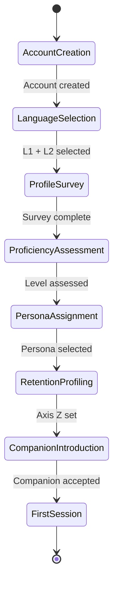
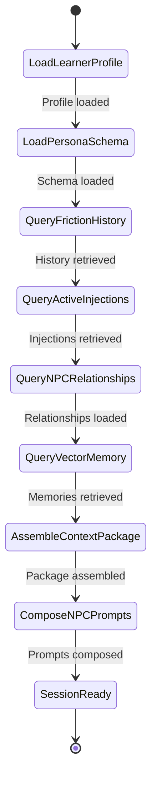
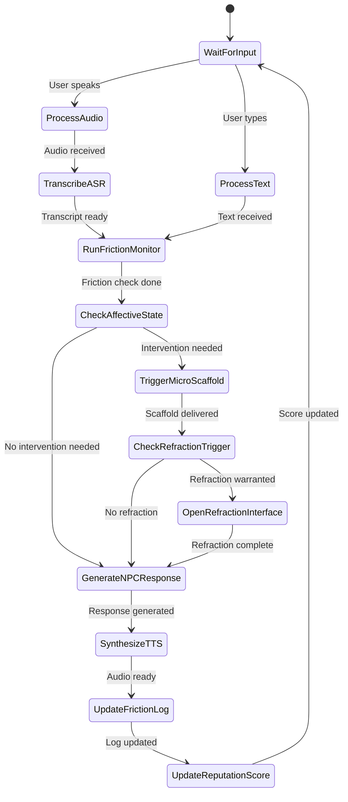
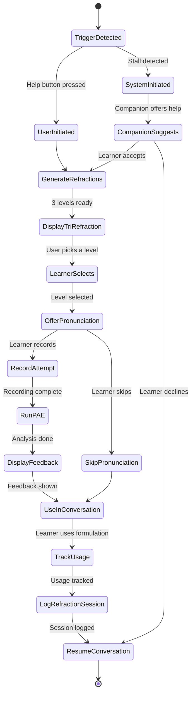
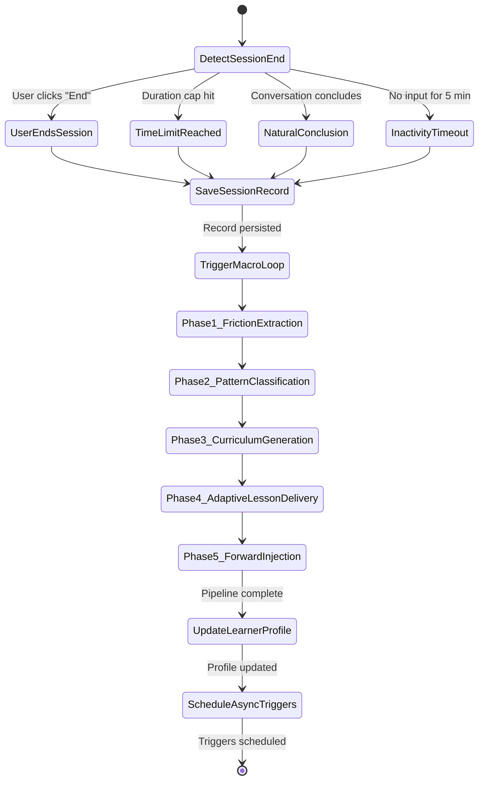
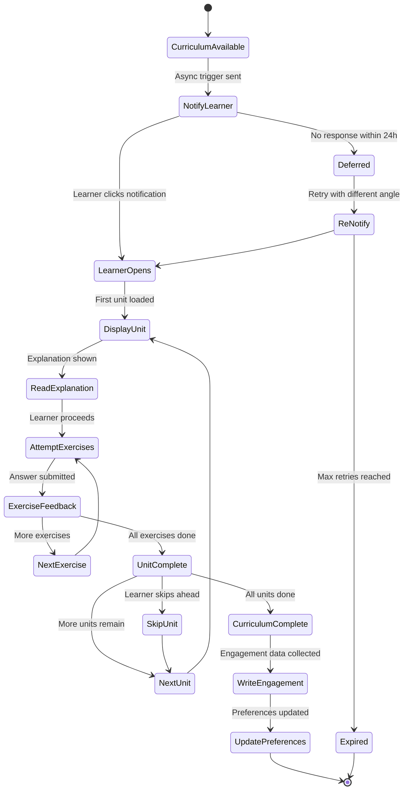
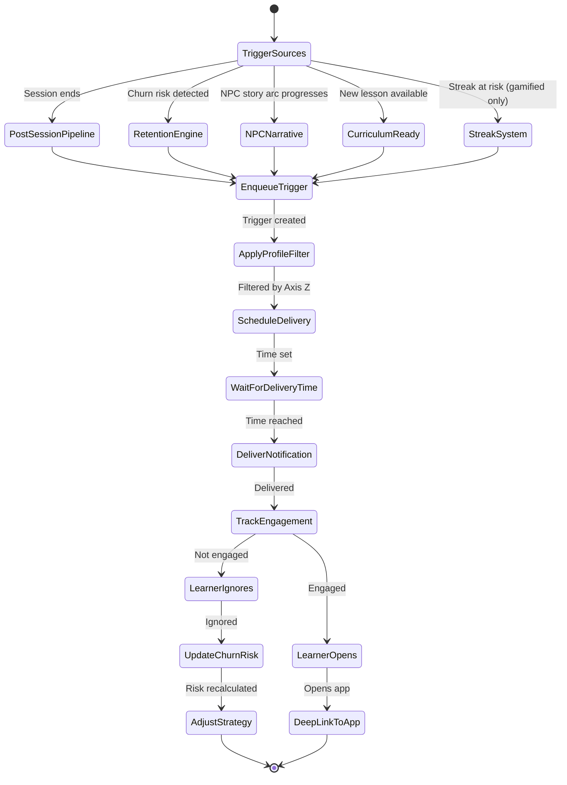

# User Interaction Loop — Complete State Machines

> The complete user-to-machine-to-product lifecycle for the AAPM Framework.
> Every state machine below specifies the exact sequence of events,
> data flows, and decision points that occur during system operation.

---

## 1. Onboarding Flow

How a user goes from zero to their first simulation session.



### Step-by-Step Contract

| Step | Input | Output | Data Written |
|------|-------|--------|--------------|
| **Account Creation** | Email/OAuth | `learnerId` | `LearnerProfile` initialized |
| **Language Selection** | L1, L2, any additional languages | Language pair config | `LearnerProfile.activePersonaId` candidates |
| **Profile Survey** | Domain (work/travel/family), goals, timeline | Learner context | Survey responses for persona matching |
| **Proficiency Assessment** | Self-report OR placement conversation (3-5 min chat with Companion) | CEFR level (A1-C2) | `LearnerProfile.currentCEFR`, `OnboardingState.initialAssessment` |
| **Persona Assignment** | Assessed level + survey | Best-fit Persona Schema | `LearnerProfile.activePersonaId` |
| **Retention Profiling** | Preference questionnaire (5 questions) | Axis Z profile | `LearnerProfile.retentionProfile` |
| **Companion Introduction** | Persona schema companion definition | Companion NPC introduction scene | `NPCRelationshipState` for Companion |
| **First Session** | — | Tier 1 guided session | First `SessionRecord` |

### Proficiency Assessment Methods

1. **Self-Report** (fastest): Learner selects their level from descriptions
2. **Placement Test** (medium): 10-15 adaptive multiple-choice questions
3. **Conversation Sample** (most accurate): 3-5 minute freeform conversation with the Tier 1 Companion, analyzed by LLM for CEFR indicators

---

## 2. Pre-Session Context Loading

What happens BEFORE any NPC interaction begins. The system assembles the complete context package that will be injected into every NPC's system prompt.



### Pre-Session Context Package (typed contract)

```typescript
interface PreSessionContext {
  /** Learner's current state */
  learner: {
    profileId: string;
    currentCEFR: string;
    matrixCoordinates: ThreeAxisCoordinates;
    codeSwitchingState: CodeSwitchingState;
    phonemeProfile: PhonemeProfile;
    retentionProfile: LearnerRetentionProfile;
    instructionalPreferences: InstructionalPreferences;
  };

  /** Active persona schema configuration */
  persona: {
    schemaId: string;
    domainContext: string;
    vocabularyMatrix: VocabularyDomain[];
    availableLocations: LocationConfig[];
    availableNPCs: NPCConfig[];
  };

  /** Recent friction patterns to watch for */
  frictionWatch: {
    recurringPatterns: Array<{ targetForm: string; occurrences: number }>;
    recentFrictionTypes: FrictionType[];
    fossilizationRisks: string[];
  };

  /** Active forward injection directives */
  activeInjections: ForwardInjectionSpec[];

  /** Per-NPC relationship context */
  npcContext: Record<string, {
    reputationScore: number;
    rememberedFacts: RememberedFact[];
    unresolvedEvents: SocialFrictionEvent[];
    opennessScore?: number;
    recentMemories: string[];
  }>;
}
```

### NPC Prompt Composition (4-Layer Stack)

Each NPC's system prompt is assembled from four layers:

1. **Base Layer**: Tier-specific prompt template (`prompts/system/tier{1,2,3}-*.md`)
2. **Schema Layer**: Domain vocabulary, cultural parameters, NPC personality from Persona Schema
3. **Memory Layer**: Relationship state, remembered facts, vector memory retrieval
4. **Injection Layer**: Forward injection directives (disguised as environmental context)

---

## 3. Real-Time Dialogue Loop

The utterance-level processing sequence during an active conversation. This is the Micro-Loop — the fastest temporal feedback mechanism.



### Processing Steps (per utterance)

| Step | Duration Target | Input | Output |
|------|----------------|-------|--------|
| **ASR Transcription** | < 500ms | Audio stream | Text + word timestamps |
| **Friction Monitor** | < 200ms | Transcript + context | `FrictionDetection` (type, severity, or null) |
| **Affective State Check** | < 100ms | Utterance features | `EmotionalState` enum |
| **Micro-Scaffold Decision** | < 50ms | Friction + affect | Scaffold action or pass |
| **Refraction Check** | < 50ms | Friction severity + type | Trigger refraction or pass |
| **NPC Response Generation** | < 2000ms | Full context + transcript | Response text |
| **TTS Synthesis** | < 1000ms | Response text | Audio stream |
| **Friction Log Update** | Async | Friction detection | Append to session log |
| **Reputation Update** | Async | Interaction outcome | Delta to NPC relationship |

### Micro-Scaffold Actions

When the Friction Monitor detects difficulty AND the learner's affective state suggests frustration or withdrawal:

- **Tier 1**: Companion offers L1 hint, rephrases in simpler L2, or code-switches
- **Tier 2**: NPC naturally repeats key phrase, slows speech, or uses gesture description
- **Tier 3**: NPC provides a brief pause ("Take your time"), but does NOT simplify register

---

## 4. Refraction Trigger Flow

The complete sequence from refraction activation to pronunciation practice.



### Data Flow

```
RefractionRequest
  → LLM generates 3 formulations with explanations
    → RefractionResponse { basic, native, formal }
      → Learner selects one
        → PAE processes recording (optional)
          → PronunciationComparisonResult
            → RefractionSession logged to persistence
```

---

## 5. Post-Session Pipeline

What happens when a session ends — triggers the 5-phase Macro-Loop.



### Session End Detection Rules

| Trigger | Condition | Behavior |
|---------|-----------|----------|
| **User-initiated** | User presses "End Session" | Immediate session save |
| **Time limit** | Session exceeds `preferredDurationMinutes` × 1.5 | Gentle NPC conclusion |
| **Natural conclusion** | Conversational goal achieved + natural pause | NPC wraps up |
| **Inactivity** | No input for 5 minutes | Session auto-saved |
| **System error** | Critical failure | Emergency save, no pipeline |

### Post-Session Output (`PostSessionExhaust`)

```typescript
interface PostSessionExhaust {
  sessionRecord: SessionRecord;
  macroLoopResult: MacroLoopPipelineState;
  updatedLearnerProfile: LearnerProfile;
  updatedNPCRelationships: NPCRelationshipState[];
  scheduledTriggers: ScheduledTrigger[];
  generatedCurriculum?: MicroCurriculum;
}
```

---

## 6. Micro-Curriculum Delivery

How the learner moves through a generated lesson between sessions.



### Completion Criteria

- **Unit complete**: All exercises attempted (not necessarily correct)
- **Curriculum complete**: All non-skipped units completed
- **Engagement threshold**: ≥60% of units completed = "engaged"
- **Mastery threshold**: ≥80% exercise accuracy across curriculum = "mastered"

### Data Written Back

- `AdaptiveLessonResult` with per-unit engagement data
- `LearnerPreferenceSignals` for future curriculum format adaptation
- Updated `InstructionalPreferences` on `LearnerProfile`

---

## 7. Asynchronous Engagement Queue

How out-of-app engagement is populated, scheduled, and delivered.



### Trigger Generation by Retention Profile

| Profile | Trigger Types | Frequency | Tone |
|---------|--------------|-----------|------|
| **Gamified Coercion** | Streak alerts, XP milestones, leaderboard | High (daily) | Competitive |
| **Organic Social** | NPC messages, companion check-ins | Medium (2-3x/week) | Warm, narrative |
| **Professional Urgency** | Deadline countdowns, benchmark alerts | Medium (2-3x/week) | Urgent, focused |
| **Intrinsic Mastery** | Challenge unlocks, precision scores | Low (1-2x/week) | Achievement |
| **Social Accountability** | Peer updates, instructor notes | Medium (2-3x/week) | Supportive |

### Queue Drain Rules

1. **Maximum 2 triggers per day** per learner (across all types)
2. **Respect notification hours** from `preferredNotificationHours`
3. **Priority ordering**: Higher priority triggers delivered first
4. **Expiry enforcement**: Triggers past `expiresAt` are discarded
5. **Engagement-adaptive**: If engagement rate drops below 20%, reduce frequency
